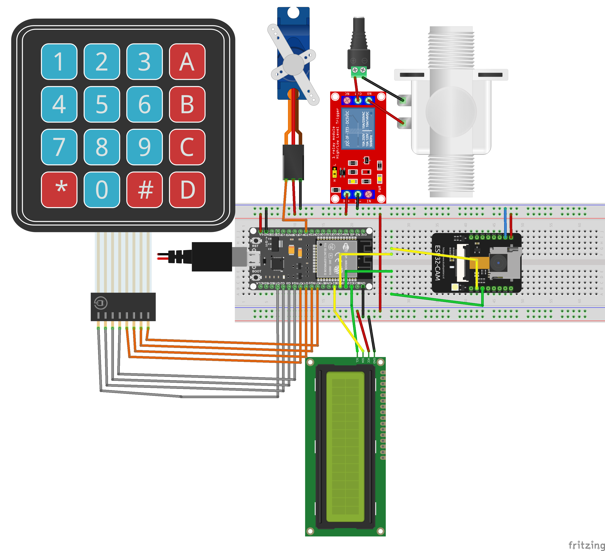

#  ESP32 Smart Lock (ESP32 + ESP32-CAM + ESP RainMaker)

##  Overview
IoT-based smart lock system developed with ESP32 and ESP32-CAM.  
Supports multiple unlocking methods: keypad password, face recognition, and remote unlocking via ESP RainMaker app.

##  Features
- **Unlock via keypad password**
- **Face recognition** using ESP32-CAM and onboard ML
- **Remote control** via ESP RainMaker app
- **EEPROM persistent storage** for access logs

##  Tech Stack
- **Hardware**: ESP32, ESP32-CAM, keypad module, servo motor, EEPROM
- **Software**: Arduino IDE, ESP RainMaker

##  Project Structure
```
ESP32_Smart_lock/
├── esp32_SmartLock/                  # *Firmware for ESP32 (main controller)*
│   ├── esp32_SmartLock.ino           # *Main program for ESP32*
│   ├── Pass_Manager.cpp              # *Password handling logic*
│   ├── Pass_Manager.h
│   ├── RMaker_handle.cpp             # *ESP RainMaker integration*
│   └── RMaker_handle.h
│
├── esp32cam_SmartLock/               # *Firmware for ESP32-CAM (face recognition)*
│   ├── esp32cam_SmartLock.ino        # *Main program for ESP32-CAM*
│   ├── HTML_interface.html           # *Web interface for camera streaming*
│   ├── camera_index.h
│   └── camera_pins.h
│
├── wiring_diagram.png                # *Circuit schematic*                    
└── README.md                         # *Project documentation*
```

## Demo 
- 
- [Link video demo (Drive)](https://drive.google.com/file/d/1oJHZzMYBnG-6hOZiwn5H-vuJyqWJS26e/view)
